# cc-switch-codex-multi-account

更新（2026-07-02）： 我自己搞不懂官方更新的功能在哪里，我仍然在使用这个笨方法，如果哪天不能用了，我再归档。该项目没归档的话就是能用。
更新（2026-06-13）： 作者已回复：新版 CC Switch 新版会有一个迁移开关来解决这个问题。
https://github.com/farion1231/cc-switch/issues/2299#issuecomment-4698073503
因此，下面的项目主要作为当前版本的 Windows 临时解决方案。

---


> Windows 上为多个 Codex / ChatGPT 账号生成隔离的原生 Codex `auth.json`，并配合 CC Switch 手动切换使用。

简体中文 | [English](README.en.md) | [日本語](README.ja.md)

Unofficial community tool. Not affiliated with OpenAI or CC Switch.


## 简介

这个工具用于在 Windows 上生成多个相互隔离的 Codex 官方账号认证文件，然后把每个账号的 `auth.json` 手动粘贴到 CC Switch 的 OpenAI Official Codex Provider 中。

适用场景：

```text
Codex CLI / VS Code Codex
→ 通过 CC Switch 切换不同 ChatGPT 账号
```

不适用场景：

```text
Claude Code
→ CC Switch 本地代理
→ ChatGPT / Codex 后端
```

上面这类是 CC Switch 自带的 Codex OAuth 功能，不是本脚本主要解决的问题。

## 安全声明

- 本脚本只在本机处理 Codex 登录文件。
- 本脚本不上传、不收集用户数据。
- 认证文件会按账号保存在本机 `.codex-account-N` 目录中。
- 本脚本不强制要求管理员权限。
- 本脚本不会调用 `codex logout`。
- 本脚本不会修改 CC Switch 自带的 OAuth 认证中心。
- 如果你对安全有担心，请先自行审阅代码后再运行。

## 效果预览

配置完成后，可以在 CC Switch 中启用不同 Codex Provider，以切换不同官方 Codex 账号。

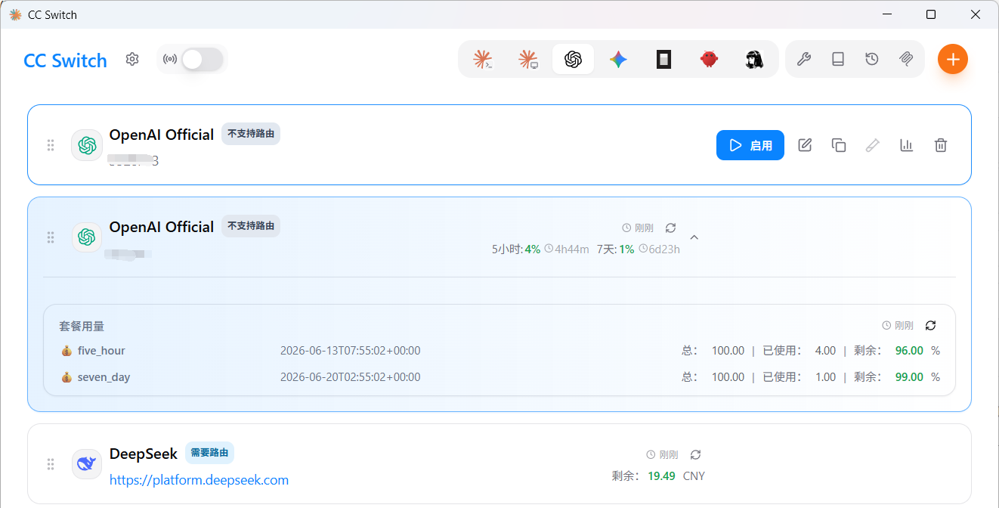

## 目录

- [设置说明](#设置说明)
- [和 CC Switch 自带 Codex OAuth 的区别](#和-cc-switch-自带-codex-oauth-的区别)
- [常见报错](#常见报错)
- [本脚本的目录结构](#本脚本的目录结构)
- [详细说明](#详细说明)
- [常见问题](#常见问题)
- [安全原则](#安全原则)
- [完成标准](#完成标准)
- [实现说明，供 AI 阅读](#实现说明供-ai-阅读)

## 设置说明

快速流程（TL;DR）：

1. 下载 Release 里的 ZIP 附件，解压后双击 `run-setup.cmd`（安全警告请选择“运行”）。
2. 按提示输入要添加的 Codex 账号数量（默认 2，最多 100）。
3. 在自动弹出的无痕浏览器中登录 OpenAI 账号，并输入 PowerShell 里显示的设备码。
4. 脚本会把当前账号的 `auth.json` 复制到剪贴板，粘贴进 CC Switch 的 Codex Provider 并保存。
5. 回到 PowerShell 按 Enter，继续下一个账号。

下面是带截图的完整步骤，给纯新手参考，附图会多一点，实际操作比较简单。

1，下载 Release 里的附件，运行 `run-setup.cmd`（安全警告请选择“运行”）。

2，如下图所示，输入你想添加的账号数量，默认两个，下列演示以 2 个为例（最多目前支持 100 个）。

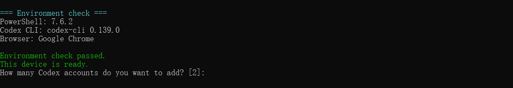

3，输入数量之后会自动打开无痕模式的浏览器，请登录你的 OpenAI 账号，输入 PowerShell 里的授权码。

登录账号页面如下：

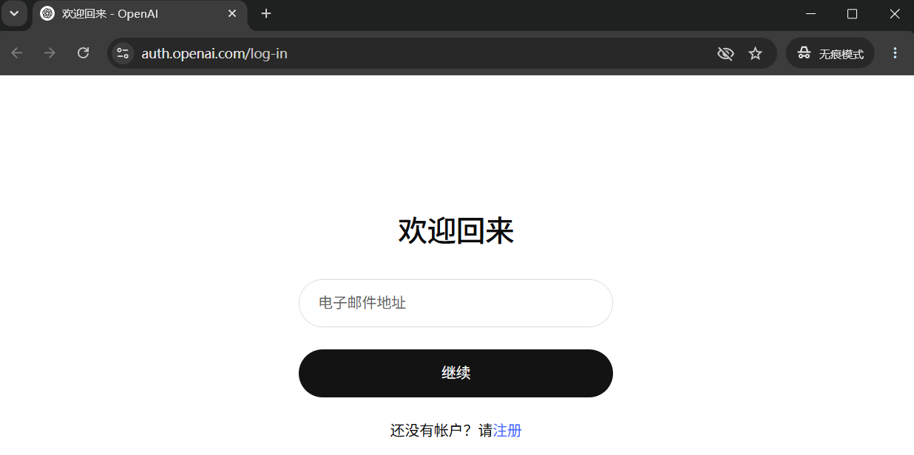

请求设备代码时，把 PowerShell 里显示的 9 位代码输入到网页端继续。

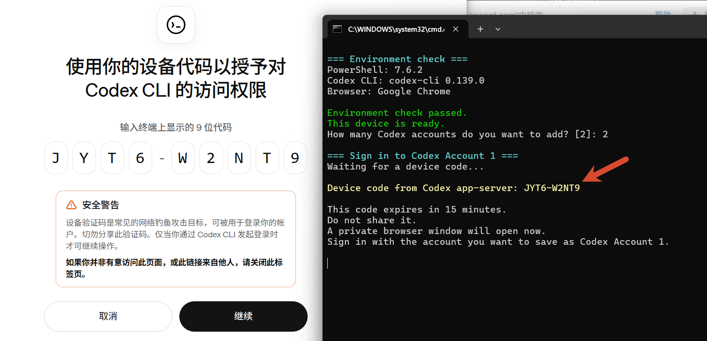

4，此时已经自动复制需要粘贴进 CC Switch 的 JSON，请打开 CC Switch 对应的区域全选粘贴。

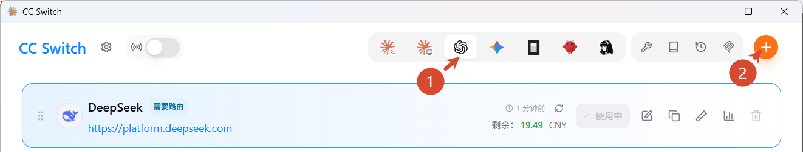

然后界面：

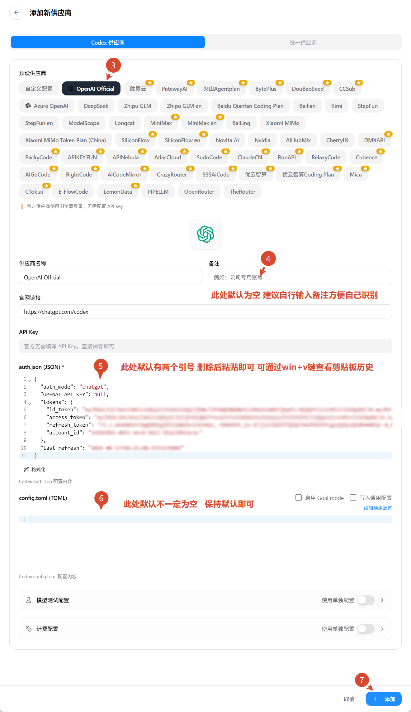

5，上一步骤点击添加之后第一个就配置好了。可以点击启用并开启用量查询。

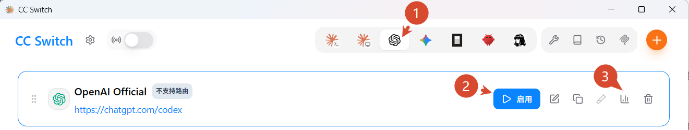

启用并开启用量查询后可正常使用：

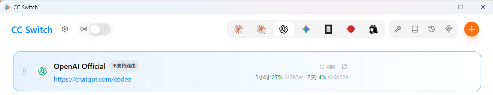

6，这是进行第二个账号设置。在原 PowerShell 输入 Enter（如下图），就会自动重新以上 1-3 的步骤，你自己重复 4-5 的步骤即可。

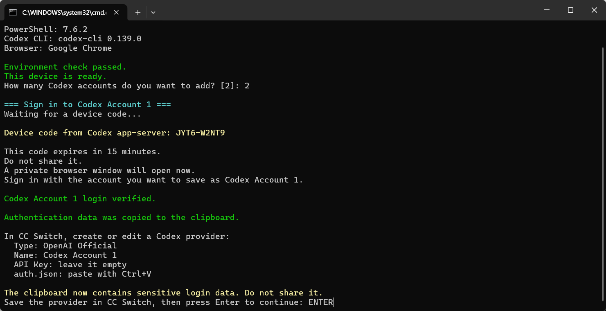

如果原本的 PowerShell 报错或者误关，完全没关系。重新运行 `run-setup.cmd`，然后可以自行根据是否设置成功跳过已设置成功的账号，或者全部重新设置。

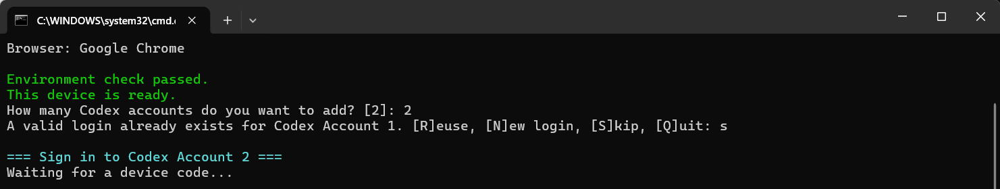

7，自此，你可以自行切换两个官方 Codex 账号进行使用。

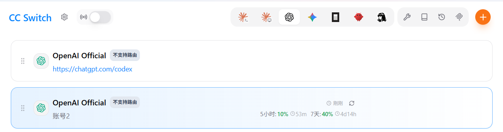

## 和 CC Switch 自带 Codex OAuth 的区别

经测试，这个脚本处理后，和 CC Switch 自带的 Codex OAuth 认证可以同时存在，通常不会冲突；它们使用不同的本地存储。

### 1. CC Switch 自带的 Codex OAuth

CC Switch 目前自带了 Codex OAuth，不过这不是切换 Codex 多账号使用，而是把 Codex 代理给 Claude：

```text
设置 → 认证 → ChatGPT（Codex OAuth）
```

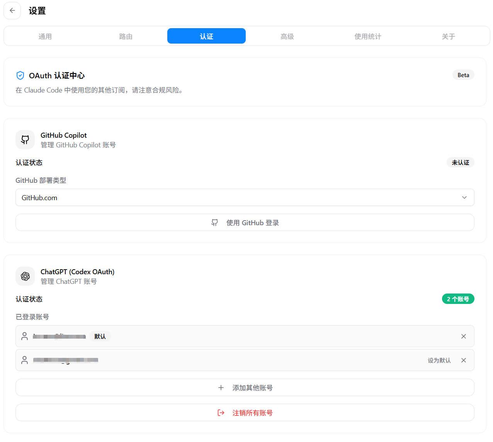

这套认证供 **Claude 供应商中的「Codex」预设**使用：

```text
Claude Code
→ CC Switch 本地代理
→ ChatGPT / Codex 后端
```

即 CC Switch 软件中，点击 Claude 右侧的添加模型界面后出现的配置。

它让 Claude Code 使用 ChatGPT Plus / Pro 所带的 Codex 能力。

配置好了的结果如下图所示：


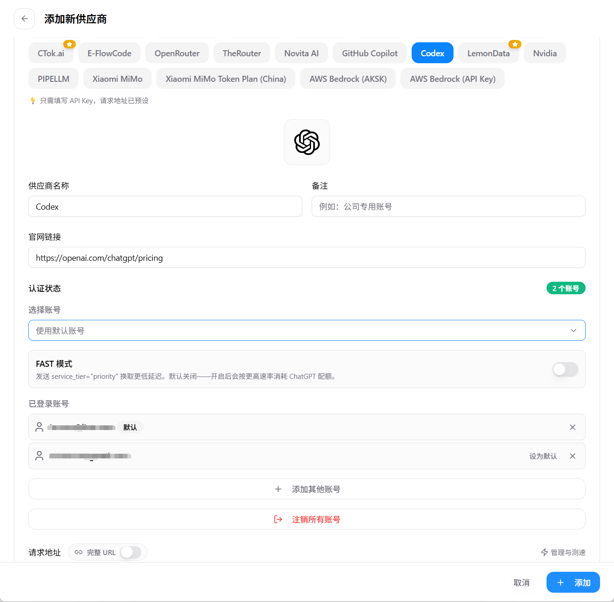

### 2. 本脚本准备的 Codex 多账号认证

本脚本准备的是原生 Codex 使用的 `auth.json`，用于：

```text
Codex CLI / VS Code Codex
→ 通过 CC Switch 切换不同 ChatGPT 账号
```

也就是说：

- CC Switch 自带 Codex OAuth：主要给 Claude 供应商里的 Codex 预设使用。
- 本脚本：为 Codex CLI / VS Code Codex 准备多个可切换的官方账号认证。

## 常见报错

### 1. device code request failed with status 429 Too Many Requests

这是 **OpenAI 设备码接口返回的 429 限流**，不是脚本逻辑错误，也不代表账号被封。

常见输出：

```text
Waiting for a device code...
Error logging in with device code: device code request failed with status 429 Too Many Requests
```

建议暂停重试 15 到 30 分钟，不要连续反复双击脚本，否则可能延长限流。

OpenAI 没有公开这个设备码端点的确切冷却时间，所以 15 到 30 分钟是实践上的保守建议，不是官方保证。

不要为了解决 429 去执行 `codex logout`。

### 2. 等待 Enter 时会不会超时

不会。

脚本在等待你把 `auth.json` 粘贴进 CC Switch 后按 Enter 时，没有脚本超时。你可以慢慢处理 CC Switch 设置。

浏览器授权登录阶段有脚本等待时间，但 OpenAI 设备码本身可能先过期，所以设备码出现后建议尽快在浏览器完成授权。

## 本脚本的目录结构

本脚本没有把任何账号的长期认证源直接放在默认 `.codex` 中。

```text
%USERPROFILE%\.codex
    CC Switch 当前运行中的 live 目录

%USERPROFILE%\.codex-account-1
    Codex Account 1 的独立认证源

%USERPROFILE%\.codex-account-2
    Codex Account 2 的独立认证源

%USERPROFILE%\.codex-account-N
    后续更多账号
```

这样所有账号规则一致，默认 `.codex` 只作为 CC Switch 的当前运行槽位。

## 详细说明

### 一、需要准备什么

需要安装：

- Windows 10 或 Windows 11
- Windows PowerShell 5.1 以上
- Codex CLI
- CC Switch
- Google Chrome 或 Microsoft Edge

检查命令：

```powershell
codex --version
```

如果你安装了 PowerShell 7，也可以检查：

```powershell
pwsh --version
```

### 二、文件说明

本工具包包含：

```text
setup-codex-accounts.ps1
run-setup.cmd
```

- `setup-codex-accounts.ps1`：主脚本。
- `run-setup.cmd`：双击启动器，优先调用 PowerShell 7，未安装时回退到 Windows PowerShell 5.1。

### 三、运行脚本

最简单的方法是双击：

```text
run-setup.cmd
```

也可以进入文件所在目录后执行：

```powershell
powershell -NoLogo -NoProfile -ExecutionPolicy Bypass -File .\setup-codex-accounts.ps1
```

脚本不会调用 `codex logout`，也不会修改 CC Switch 自带的 OAuth 认证中心。

### 四、环境检查

脚本会检查：

- 是否为 Windows；
- PowerShell 是否为 5.1 或更高版本；
- Codex CLI 是否可用；
- Chrome 或 Edge 是否存在；
- 剪贴板命令是否可用；
- 用户目录是否可写。

成功时会显示绿色文字：

```text
Environment check passed.
This device is ready.
```

然后输入需要添加的账号数量：

```text
How many Codex accounts do you want to add? [2]
```

直接按 Enter 默认添加两个账号，也可以输入 `3`、`4` 等，最多 100 个。

### 五、依次登录每个账号

脚本会为每个账号使用独立目录：

```text
Codex Account 1 → .codex-account-1
Codex Account 2 → .codex-account-2
```

每轮登录时，脚本会先从 Codex app-server 获取一次性设备码，再显示：

```text
Device code from Codex app-server: XXXX-XXXXX

This code expires in 15 minutes.
Do not share it.
A private browser window will open now.
```

随后会自动打开一个隔离的 Chrome 无痕窗口或 Edge InPrivate 窗口。

在浏览器中：

1. 登录准备保存为当前 `Codex Account N` 的 ChatGPT 账号；
2. 输入 PowerShell 中显示的设备码；
3. 确认授权；
4. 等待 PowerShell 自动验证。

浏览器使用独立的临时数据目录，不会复用普通浏览器的 Cookie，也不会与下一账号串号。授权结束后，脚本会关闭并清理这个临时浏览器环境。

成功时会显示：

```text
Codex Account N login verified.
```

脚本会验证：

- `auth.json` 是否存在；
- 文件是否为空；
- 是否为有效 JSON；
- `codex login status` 是否成功。

### 六、把账号加入 CC Switch

每个账号验证成功后，脚本会自动把对应 `auth.json` 内容复制到剪贴板，并显示：

```text
Authentication data was copied to the clipboard.
```

然后在 CC Switch 中操作：

1. 进入 **Codex** 应用页面；
2. 添加新供应商；
3. 选择 **OpenAI Official**；
4. 填写：

```text
供应商名称：Codex Account 1
API Key：留空
Auth.json：Ctrl + V 粘贴
```

第二个账号命名为：

```text
Codex Account 2
```

保存后回到 PowerShell，按 Enter，脚本会继续处理下一个账号。

剪贴板提醒：

`auth.json` 是敏感登录凭据。脚本只负责复制，不会清理剪贴板或剪贴板历史。不要把内容粘贴到聊天、工单、GitHub、公开文档或截图中。

### 七、设定默认账号

所有账号添加完成后，在 CC Switch 中：

```text
Codex Account 1
→ 启用
```

然后完全关闭并重新打开：

- VS Code；或
- Codex CLI 终端。

此时：

```text
.codex-account-1 = Account 1 的独立认证源
.codex           = CC Switch 写入的当前 live 账号
```

### 八、以后如何切换

切换到另一个账号：

```text
1. 停止当前 Codex 任务
2. 关闭 VS Code / Codex
3. 在 CC Switch 中启用另一个 Codex Account Provider
4. 重新打开 VS Code / Codex
5. 新建会话
```

不要使用：

```powershell
codex logout
```

`logout` 不是账号切换方式，可能撤销当前认证并导致 CC Switch 中保存的凭据失效。

### 九、添加第三、第四个账号

重新运行脚本并输入更大的账号数量，例如：

```text
4
```

脚本发现已经存在且有效的账号时，会询问：

```text
[R]euse  复用现有登录
[N]ew    重新登录
[S]kip   跳过
[Q]uit   退出
```

对 Account 1 和 Account 2 选择 `R`，再继续登录 Account 3 和 Account 4 即可。

### 已有账号再次运行会怎样

如果本地已经存在：

```text
%USERPROFILE%\.codex-account-1\auth.json
```

脚本会先验证这个登录是否仍然有效。

如果有效，会询问：

```text
A valid login already exists for Codex Account 1. [R]euse, [N]ew login, [S]kip, [Q]uit
```

各选项含义：

- `R`：复用已有登录，并把现有 `auth.json` 复制到剪贴板，方便重新粘贴到 CC Switch。
- `N`：重新登录。脚本会先把旧 `auth.json` 备份为 `auth.json.backup-时间戳`，新登录成功后删除备份；如果失败，会恢复旧文件。
- `S`：跳过这个账号，继续处理下一个账号。
- `Q`：退出后续处理。

如果已有 `auth.json` 无效、太小、不是 JSON，或 `codex login status` 验证不通过，脚本会把它当成未登录账号，并进入新的登录流程。

### 十、换电脑时怎么做

建议在每台 Windows 电脑上分别运行脚本并重新授权，不要直接把旧电脑的 `auth.json` 复制到新电脑。

原电脑上的认证通常不会因为新电脑重新登录而自动失效，但两台电脑使用同一个 ChatGPT 账号时仍共享同一账号的 Codex 使用额度。

## 常见问题

### 没有找到 Codex CLI

检查：

```powershell
codex --version
```

确认安装后重新打开 PowerShell。

### 浏览器登录了错误账号

关闭该临时窗口，终止本轮并重新运行。每轮应明确核对当前登录的 ChatGPT 账号。

### CC Switch 显示会话已过期

重新运行脚本，对相应账号选择 `N` 重新登录，再把新生成的认证内容粘贴回对应 Provider。

### 切换后仍显示旧账号或旧模型

完全关闭 VS Code 和 Codex 终端，再重新启动。不要只关闭聊天面板。

## 安全原则

不要公开：

- `auth.json`；
- refresh token；
- access token；
- 设备码；
- CC Switch 数据库备份。

不要把这些目录提交到 Git：

```text
.codex-account-*
.codex
.cc-switch
```

如果凭据泄露，应重新登录生成新认证，并替换 CC Switch 中对应 Provider 的内容。

## 完成标准

```text
1. .codex-account-1\auth.json 存在并验证成功
2. .codex-account-2\auth.json 存在并验证成功
3. CC Switch 中存在 Codex Account 1 和 Codex Account 2
4. 两个 Provider 的 API Key 均为空
5. 两个 Provider 的 auth.json 均已填写
6. 当前启用 Codex Account 1
7. 默认 .codex 只作为 CC Switch live 目录
8. 切换账号时不运行 codex logout
```

## 实现说明，供 AI 阅读

本章节给代码智能体阅读，避免后续维护时把用户教程、实现边界和历史假设混在一起。

### 1. 项目目标

本项目是非官方社区工具，用于在 Windows 上为多个 ChatGPT/Codex 账号生成相互隔离的原生 Codex `auth.json`，再由用户手动粘贴到 CC Switch 的 OpenAI Official Codex Provider 中。

项目不隶属于 OpenAI 或 CC Switch。

### 2. 关键边界

- 不在仓库中保存 `auth.json`、`codex_oauth_auth.json`、token、设备码或 CC Switch 本地凭据。
- 不调用 `codex logout`。
- 不自动写入或修改 CC Switch 数据库。
- 不上传用户认证数据。
- 每个账号使用独立 `CODEX_HOME`，例如 `%USERPROFILE%\.codex-account-1`。
- 默认 `%USERPROFILE%\.codex` 只作为 CC Switch 当前 live 目录。
- 每轮登录使用独立临时浏览器 profile。

### 3. 当前登录实现

主脚本是 `setup-codex-accounts.ps1`。

登录流程使用 Codex app-server 的 stdio JSON-RPC，而不是解析 `codex login --device-auth` 的人类可读输出。

设备码来自 app-server 返回的结构化字段：

```text
account/login/start
type = chatgptDeviceCode
result.userCode
result.verificationUrl
```

不要改回正则抓取 CLI 文本输出。CLI 文本格式不是稳定接口，容易把 `COMMAND-LINE` 等普通短语误判成设备码。

### 4. 认证文件处理

每个账号的长期认证源目录：

```text
%USERPROFILE%\.codex-account-N
```

登录成功后脚本验证：

- `auth.json` 存在；
- 文件长度合理；
- JSON 可解析；
- `codex login status` 显示已登录。

如果已有有效 `auth.json`，用户可以选择：

- `R`：复用；
- `N`：重新登录；
- `S`：跳过；
- `Q`：退出。

重新登录前会备份旧 `auth.json`，新登录失败时恢复旧文件。

### 5. 浏览器和剪贴板

脚本使用 Chrome 或 Edge 的独立临时 profile 打开授权页，避免复用普通浏览器 Cookie 导致串号。

授权成功后，脚本把 `auth.json` 内容复制到剪贴板，等待用户手动粘贴到 CC Switch。

脚本不会自动清理剪贴板或剪贴板历史。如果要新增清理功能，应明确告知用户这只能清当前剪贴板，不能保证清除 Windows 剪贴板历史。

### 6. 超时和限流

脚本中的超时只控制本地等待：

- 等 Codex app-server 返回设备码；
- 等浏览器授权完成。

OpenAI 设备码本身的有效期由 OpenAI 控制，脚本不能延长。

`429 Too Many Requests` 是设备码请求限流，不代表脚本逻辑错误，也不代表账号被封。提示用户暂停 15 到 30 分钟，不要反复重试。

### 7. 文档维护规则

面向普通用户的教程优先放在前面的章节。

技术细节、实现边界、脚本内部流程和供 AI 维护使用的信息，优先放在本章节，避免打乱用户设置说明。

如代码和文档冲突，以当前代码为准，并同步更新本章节或标记旧说明。
